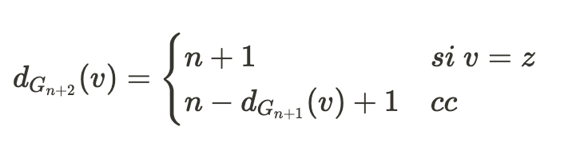

### Ejercicio 8

**Nota:** c(K) se lee como el _complemento de K_

**Caso Base:** con n = 2 tenemos G2 donde tenemos un único par de nodos con grado 1, por lo que cumple.\
**HI:** _Gn+1 = c(Gn u K1)_\
**Quiero ver que:** _Gn+2 = c(Gn+1 u K1)_\
Tomando a _z_ como el nodo que representa a _K1_, vamos a hacer una función para saber el grado de un nodo en Gn.

Ahora nos preguntamos si el grado de _v_ es igual al de _w_ en en _Gn+2_\
Por las función se nos separa en 2 casos

- Si _v = z o w = z_

Siempre en _Gn_ los grados son mayores a 0 ya que fueron unidos al nodo _z_, por lo tanto este caso es `absurdo`

- Si _v ≠ z y w ≠ z_

Haciendo la recursión llgeamos a que _v_ y _w_ son los los 2 únicos nodos de G2 (caso base), los cuales van aumetnado de grado pero siempre siendo **único par con grados iguales**.