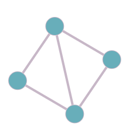

### Ejercicio 9

Tenenmos que demostrar por **inducción** que todo grafo _G_ conexo con 2n vértices y más de n^2 aristas contiene al menos un triangulo.

**Caso base:** n = 2 tenemos el siguientes grafo

**HI:** Todo grafo _G_ conexo con 2n vértices y más de n^2 aristas contiene al menos un triangulo.

**QVQ:** Para un grafo conexo de 2(n+1) vértices y más de (n+1)^2 aristas contiene al menos un triangulo.

Con un grafo conexo _G_ con _2n_ vértices y más de n^2 aristas que por **HI** cumple con la condición. Entonces le agregamos 2 nodos _(v1,v2)_ y _(n+1)^2 - n^2_ aristas, es decir _2n + 1_ aristas. Lo que significa que conectamos a _v1_ con n nodos y _v2_ con n nodos (2n), además los conectamos entre ellos (2n + 1). 

Con lo cuál elijo cualquier nodo _w_ que se encuentre entre _N(v1) ∩ N(v2)_ generando un triangulo entre _w, v1 y v2_. En caso de que la intersección de vecinadrios este vacía signfica que tenemos que usar a _v1_ o _v2_ como intermediarios, y elegir 2 nodos que esten conectado entre si y _v1_ o _v2_ pertenezca a la intersección de su vecindario.

Con lo cual, `probamos por inducción` que todo grafo _G_ conexo con 2n vértices y más de n^2 aristas contiene al menos un triangulo.