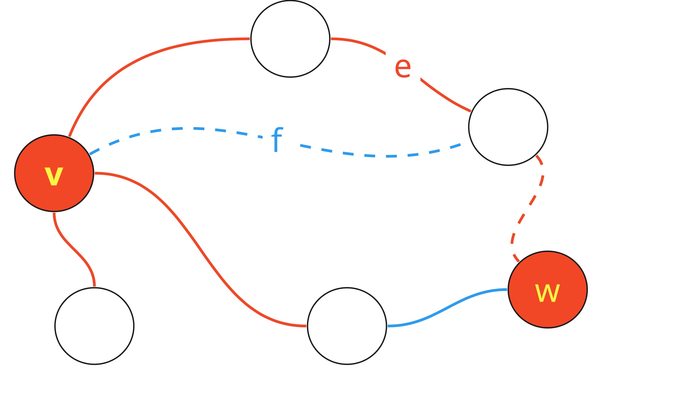

### Ejercicio 12

_Demostrar que_ $T$ _es `maximin`_ $\iff T$ _es un _AGMax__

**Definiciones**\
_AGMax_: Dado un grafo $G$ un _AGMax_ $T$ es un árbol generador de máximo costo, es decir $|T| \geq |T'|\space\forall T'$ árbol generador.

_Maximin:_ $P$ es un camino _maximin_ de $v$ a $w$ si se cumple que $P$ maximiza la arista de menor costo entre $v$ y $w$.

$\rightarrow)$ Tomamos un _AGMax_ $T'$ el cual es el que tiene más aristas en común con $T$ y suponemos que $T'$ tiene una arista $e'$ la cual no está en T, es decir $e'\in E_{T'} \land e'\notin E_{T}$.

Por lo tanto sabemos que si agregamos a $e'$ en $T$ vamos a formar un ciclo $C$ de longitud $k$ formado por $e_1,\dots,e_k,e'$.

Como $T$ es `maximin` $|e'| ≤ |e_i|\space\forall i\in C$ , tomamos la arista $e_i \notin T$ de $C$, la cual existe ya que si no habría un ciclo en $T'$.

Entonces $\widetilde{T} = (T' + e_i) - e'$ es AG, pero en particular es AGM ya que $|e_i| - |e'| ≥ 0$.
`ABSURDO!` ya que $\widetilde{T}$ comparte más aristas con $T$ que $T'$ y es _AGMax_.

$\leftarrow)$ Sean $v,w\in V_T$ con un camino `maximin` $P_{vw}$ el cual no está completamente en el _AGMax_ $T$. Esto significa que existe una arista $f\notin E_T$ pero que $f\in P_{vw}$.

Sea $Q_{vw}$ el camino en $T$ desde $v$ hasta $w$ y $e$ la arista de menor peso en $Q_{vw}$.

- Las aristas _rojas_ forman parte de $T$
- Las aristas _punteadas_ forman parte de $P_{vw}$
- Las aristas _azules_ **no** forman parte de $T$

Tenemos **2 casos**:\
Si $|e| < |f|$ significa que existe $T' = T + f - e$ tal que $|T'| > |T|$ por lo tanto $T$ no es un es un _AGMax_ lo cual es `absurdo`.

Si $|e| \geq |f|$ significa que se puede eliminar $f$ de $P_{vw}$ y agregar las aristas de $Q_{vw}$ y seguiría siendo un camino `maximin` ya que no incluimos una arista con el peso menor al mínimo que ya había.

Utilizando este último paso podemos generar un camino `maximin` $P_{vw}'$ donde $\forall e\in P_{vw}'$ se cumple que $e\in E_T$

Por lo tanto queda demostrado que si $T$ es un AGMax $\rightarrow$ $T$ está formado por caminos `maximin`