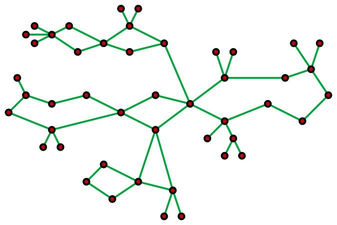

### Ejercicio 16

_G es `cactus` cuando cada una de sus aristas pertenece a lo sumo a un único ciclo_



**Definiciones**\
Sea $T$ un árbol DFS de un grafo $G$.\
Sea $T(v,w)$ el único camino entre $v$ y $w$ en $T$ para todo $v,w\in V_G$.

**a)** $G$ _es `cactus`_ $\iff\forall vw\in E_G\setminus E_T $ _ocurre que_ $T(v,w) + vw$ _es el **único** ciclo que contiene a las aristas en_ $T(v,w)$.

$\rightarrow)$ Si tenemos un árbol DFS $T$ con $T(v,w)$, sabemos que al agregarle $vw$ se forma un ciclo $C_{vw} = T(v,w) + vw$. Asumimos que estas aristas no pertenecen a un **único** ciclo, entonces tenemos 2 casos:

Si $|T(v,w)| = 1$ entonces no hay ninguna backedge que lo cubre por lo tanto no existe $vw$ que pertenecen a $E_G\setminus E_T$.

Si $|T(v,w)| > 1$

Si $v$ es raiz y $w$ no es hoja podemos tomar a $u$, descendiente de $v$ y ancestro de $w$, y a $z$, descendiente de $w$, los cuales tienen un camino $T(u,z)$ al cual sumandole la arista $uz$ formaríamos un ciclo $C_{uz}$. Lo cual es **absurdo**, ya que como $G$ es `cactus` sabemos que todas las aristas pertenecen a un **único** ciclo y en este caso tenemos todas las aristas del camino $T(u,w)$ en 2 ciclos en $G$ ($C_{vw}$ y $C_{uz}$) y eso no puede pasar.

Si $v$ no es raiz y $w$ es hoja podemos tomar a $u$ ancestro de $v$ y $w$, y a $z$, descendiente de $v$ y ancestro de $w$, los cuales tiene un camino $T(u,z)$ al cual sumandole la arista $uz$ se forma el ciclo $C_{uz}$. Lo cual es **absurdo** ya las aristas en $T(v,z)$ están en 2 ciclos en $G$.

Si $v$ es raiz y $w$ es hoja podemos tomar 2 nodos $u$ y $z$, $u$ ancestro de $z$, donde ambos son ancestros de $w$ y descendientes de $v$. Si le sumamos la arista $uz$ a $T(u,z)$ entonces como en los casos anteriores, las aristas de $T(u,z)$ pertenecen a 2 ciclos en $G$, lo cual es **absurdo**.


$\leftarrow)$ Como para toda arista $vw$ que pertenecen a $E_G\setminus E_T$ ocurre que $T(v,w) + vw$ es el único ciclo que contiene a las aristas en $T(v,w)$ podemos decir que si agregamos todas las aristas de $E_G\setminus E_T$ a $T$, no puede pasar que $vw$ pertenezca a más de un ciclo, por lo que $G$ es cactus ya que para todas las aristas a lo sumo pertenecen a un úncio ciclo.

**b)** _Demostrar que los grafos_ $G$ _`cactus` tienen_ $O(n)$ _aristas_

Como cada arista pertenece a lo sumo a un único ciclo significa que a lo sumo esta cubierta por una backedge. 

Supongamos que la arista $vw$ esta cubierta por 2 de una backedges, $st$ y $uz$, con lo cual hay más de 2 caminos para llegar a $v$ y $w$. Tenemos como primer camino la arsita $vw$, como segundo $T(w,s) + st + T(t,v)$ y por último $T(w,u) + uz + T(z,u)$

Por lo tanto, la arista $vw$ pertenece a más de un ciclo, lo cual es **absurdo** ya que $G$ es cactus. En conclusión la cantidad de aristas en un grafo cactus es máximo $2n$, el cual esta contenido en $O(n)$.

**c)** _Algoritmo para determinar si un grafo es `cactus` y devolver todos los ciclos o los 2 ciclos que comparten una arista_

Sabemos que $O(m) = O(n)$, inciso `(b)`. 

La idea sería hacer un DFS en $O(n)$ y luego por cada _tree edge_ podemos contar cuantás _backedges_ la cubren con algorimtos lineales ($O(n)$) vistos en la practica (ej: cubren(v)). 

Si una _tree edge_ tiene más de 1 _backedges_ entonces recorremos esos ciclos y los devolvemos. $O(n)$ ya que tenemos $n$ aristas en $G$.

Si no por cada _backedge_ $vw$ recorremos su $T(w,v)$ y devolvemos $vw + T(v,w).$ En este caso tenemos cómo máximo $O(n)$ backedges y los $T(v,w)$ serían recorridos en $O(n)$ dejandonos con $O(n^2)$. Sin embargo, en caso de que una _backedge_ cubra un camino de largo $n$ significa que es la única _backedge_ por que $G$ es `cactus`. Por otro lado, si hay muchas _backedges_ significa que cubren pocas aristas, con lo cual los $T(v,w)$ serán cortos. Por lo tanto, pordíamos decir que es $O(n)$

```
1. DFS(G) + cubren(T, E(G)) 
2. Contar_coberturas(E(G))
3. Si es cactus ret: ciclos(G)
4. Si no ret: ciclos_encadenados(G)
```

**d)** _Algoritmo para encontrar un AGM en un grafo cactus_

La idea es hacer un DFS en $O(n)$ marcando todos los ciclos, luego por cada ciclo eliminamos la arista más costosa en $O(n)$.

**e)** _Formula para contar la cantidad de AGMs de un grafo cactus_

Para armar un $AGM$ $T$ basta con eliminar la arista $e$ de mayor peso de cada ciclo $C$, ya que si eliminamos otra de menor peso $e'$ obteniendo un árbo; $T'$, $|T'| < |T|$ y por lo tanto $T$ no sería un $AGM$.

Por otro lado, como sabemos que $G$ es `cactus`, entonces cada ciclo $C$ nos va a dar posibilidades, dependiendo de cuantas aristas de mayor peso tengo, de armar diferentes $AGMs$.

Por lo tanto, la cantidad de $AGMs$ de un grafo cactus es la productoria en la cantidad de ciclo $|C|$ y por cada ciclo $c_i$ la cantidad de aristas $e$ que tienen peso máximo $m_i$.

$$

\prod_{i=0}^{|C|}\sum_{j=0}^{c_i} |e_j| = m_i

$$