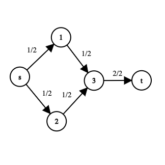
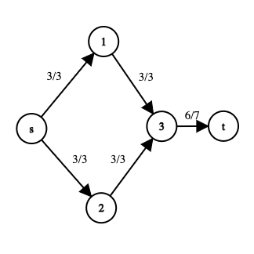

### Ejercico 1

**a)** Como cada arista tiene capacidad par y el flujo máximo satura las capacidades significa que la suma de cada capacidad saturada debe ser `par` por suma de pares. No puede pasar que las aristas no esten saturadas ya que entocnes no sería flujo máximo.

**b)** No necesariamente ya que `impar + impar = par`

**c)** No necesariamente ya que `impar + impar = par` como en `b`

**c)** No necesariamente ya que:

