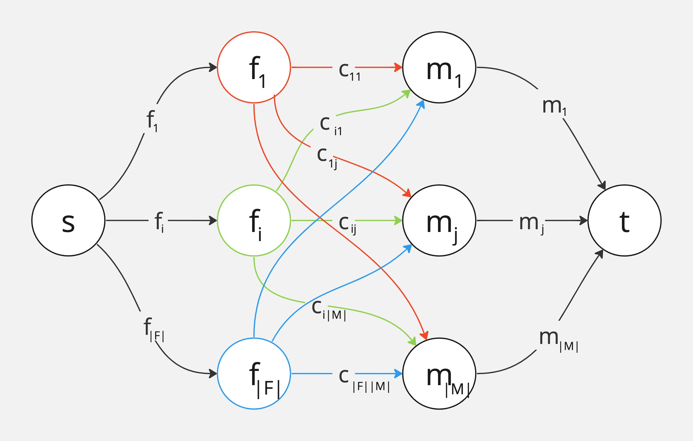

### Ejercicio 7

Si _F = { f1,...,f|F| }_ son los solteros de las _familias_, _M = { m1,...,m|M| }_ son las _mesas_ y _C = { cij | 1 ≤ i ≤ |F| y 1 ≤ j ≤ M}_ representa que en la mesa _j_ sólo pueden ir _cij_ solteros de la família _i_.

La `unidad de flujo` representa la cantidad de personas de una familia que se van a sentar en una mesa. 

_Existe una forma de asignar U familiares <--> Existe un flujo factible de U flujo_

**->)**\
• _Conservación:_ Los familiares de la familia i son repartidos en cada mesa j. Luego todos los familiares que llegan a las mesa j no pueden ser más de la capacidad mj de la mesa j.

• _Capacidad:_ 
- s -> fi: máximo se le asigna fi
- fi -> mj: máximo se le asigna cij
- mj -> t: máximo se le asigna mj

**<-)**\
Por cada unidad de flujo que sale de _s_ podemos decir que un familiar de la familia _i_ se sienta en la mesa _j_ sin sobrepasar _cij_. Entonces podemos asignar hasta _fi_ familiares a la familia _i_. A la mesa _j_, _cij_ familiares de la familia _i_ sin sobrepasar la capacidad máxima _mj de la mesa _j_.\
Por lo tanto, asignamos _U_ familiares ya que cada unidad representa un familiar.

**Complejidad**\
• Nodos: O(F + M) (_F_ familias, _M_ mesas)\
• Aristas: O(F * M) (_F_ familias, _M_ mesas)\
Con _E&K_ tenemos que O(V*E^2) = O(F + M * (FM)^2)

