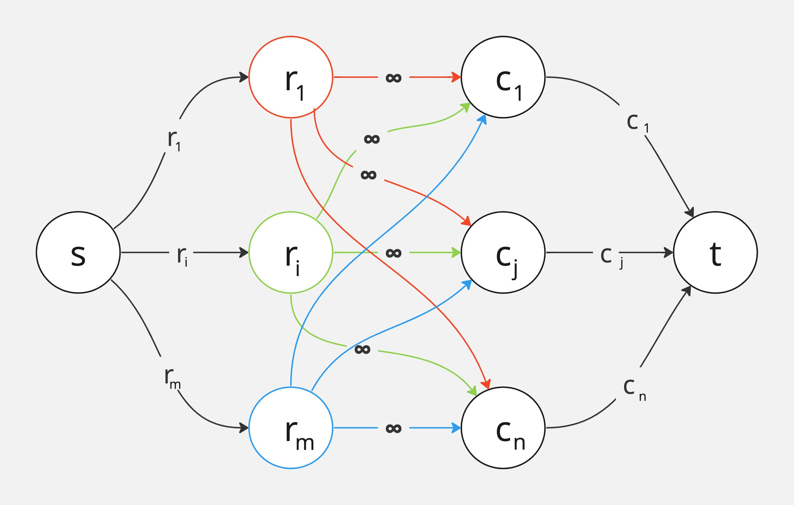

### Ejercicio 8

La **unidad de flujo** representa un valor que se le asigna a la celda que esta ubicada en _ri_ y _cj_.

_Existe una forma de asignar los valores en una matriz que para toda fila _i_ suman _ri_ y para toda columna _j_ suman _cj_, siendo la suma de todas las filas U <--> Existe un flujo factible de U flujo_.

**->)**\
• _Conservación:_ Para cada _ri_, que recibe flujo de _s_, se reparte entre todos los nodos de las columnas, los cuales reciben de todas las filas y luego sin superar su capacidad tienen un flujo hacia _t_.

• _Capacidad:_ 
- s -> ri: máximo se le asigna ri
- cj -> t: máximo se le asigna cj

**<-)**\
Para cada `unidad de flujo` que sale de _s_ podemos decir que representa el valor de la celda que está ubicada en la fila _i_ y la columna _j_, donde de _s->ri_ representa la suma de toda la fila _i_ y de _cj->t_ representa la suma de toda la columna _j_. Por lo tanto nunca van a sumar más de _ri_ ni _cj_ cada una respectivamente, cumpliendo con las restircciones.

**Complejidad**\
• Nodos: O(N + M) (_N_ columnas, _M_ filas)\
• Aristas: O(N * M) (_N_ columnas, _M_ filas)\
Con _E&K_ tenemos que O(V*E^2) = O(N + M * (NM)^2)