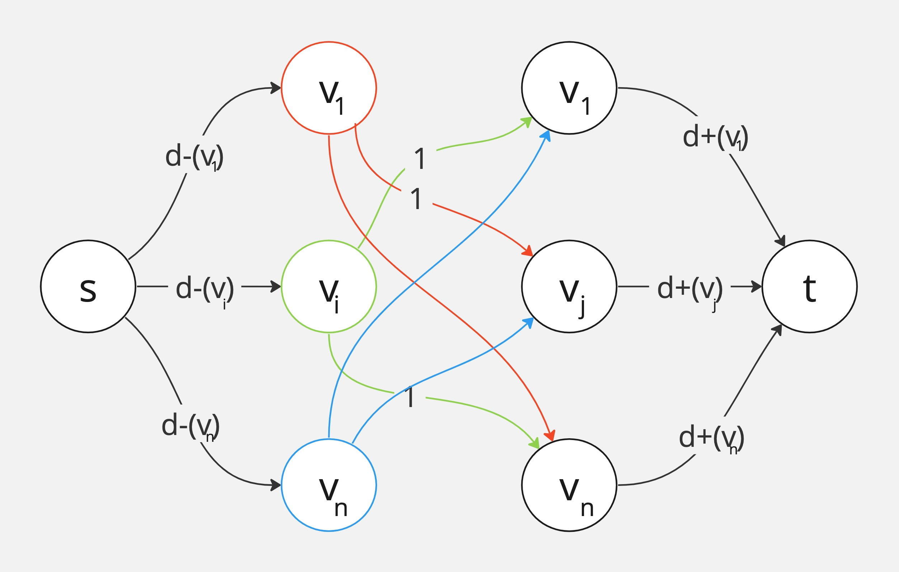

### Ejercicio 9

La **unidad de flujo** representa una arista que sale de _vi_ hasta _vj_ con _1 ≤ i,j ≤ vj_

- _s -> vi_ tiene capacidad _d-(vi)_ ya que representa la cantidad de aristas que salen de _vi_
- _vi -> vj_ tiene capacidad 1 ya que sólo puede haber una arista entre 2 nodos vecinos.
- _vj -> t_ tiene capacidad _d+(vj)_ ya que representa la cantidad de aristas que llegan a _vj_

_Existe un flujo factible de U flujo <--> Existe un digrafo D cuya secuencia digrafica es U._

**->)** Se representa las **capacidades** ya que a todas las aristas se le asignan las capcidades vistas arriba. Las **conservaciónes** se respeta ya que para cada unidad que entra en _vi_ se dirige a un _vj_. Luego cada unidad que entra a _vj_ se dirige a _t_.

**<-)** Podemos decir que por cada unidad de flujo que sale de _s_ tenemos una arita que sale de _vi_ y llega a _vj_. En todo momento se respetan las restricciones del enunciado dados los grados de salida y entrada para cada nodo en un digrafo existente.

**Complejidad**\
• Nodos: O(N) (_N_ nodos)\
• Aristas: O(N^2) (_N_ nodos)\
• Flujo: O(D) (D la suma de los grados de salida)\
Con _E&K_ tenemos que O(V*E^2) = O(N * (N^2)^2) = O(N^5)\
Con _F&F_ tenemos que O(mU) = O(N^2 * D)