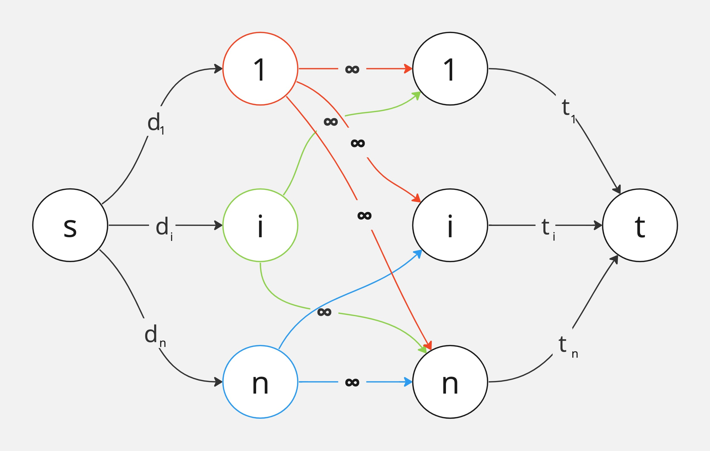

### Ejercicio 11

- _di_ dispositivos de tipo _i_
- _ti_ tomacorrientes de tipo _i_
- _aij_ adaptador de tipo _i_ a _j_

Podemos conectar los adaptadores como queramos ya que tenemos __ilimitados__ de cada tipo que se nos brinda. Por lo tanto, para aprovechar esto, pre-procesamos todas las conexiones posibles y las condensamos en una.

Ejemplo:\
d1 -> a12 -> a24 -> a45 -> t5 = d1 -> a15 -> t5

Cada __unidad de flujo__ representa un dispositivo del tipo _i_ que se conecta directamente o por adaptador al tomacorriente _j_, _1 ≤ i,j ≤ n_

_Existe un flujo factible de U flujo <--> U dispositivos se pueden conectar a un tomacorrientes._

**->)** La arist s->i existe para representar los dispositivios de tipo _i_ que no excede la cantidad _di_. Similar con i->t pero con _ti_. Para cada unidad que llega a _i_ sale a un _j_, el cual la envía a _t_ sin superar _tj_. Por lo tanto se respetan las __capacidades__ y la __conservación__.

**<-)** Podemos decir que para cada unidad de flujo que sale de _s_ a un nodo _i_ y pasa por _j_ representa un dispositivio _i_ que se conecta con adapataodres si _i ≠ j_ y sin adaptadores si _i = j_ a un tomacorrientes _j_. Veamos que cumplen las restricciones:\
• Se usan máximo _di_ dispositivos de tipo _i_ que se conectan con o sin adaptadores.\
• Tenemos a lo sumo _ti_ tomacorrientes del tipo _i_ ocupados.

**Complejidad**\
• Nodos: O(N) (_N_ nodos)\
• Aristas: O(N^2) (_N_ nodos)\
• Flujo: O(D) (D cantidad de dispositivos de cada tipo)\
Con _E&K_ tenemos que O(V*E^2) = O(N * (N^2)^2) = O(N^5)\
Con _F&F_ tenemos que O(mU) = O(N^2 * D)
